  <picture>
    
  </picture>

# Hey there!

## I like these things

<picture>
  <source media="(prefers-color-scheme: dark)" srcset="https://skillicons.dev/icons?i=html%2Ccss%2Cjs%2Cts%2Cnodejs%2Cvue%2Cnuxtjs%2Cphp%2Claravel&theme=dark">
  
</picture>

## My Statistics

<picture>
  <source media="(prefers-color-scheme: dark)" srcset="https://streak-stats.demolab.com?user=Sjoertjuh&hide_border=true&theme=dark">
  
</picture>
 
<picture>
  <source media="(prefers-color-scheme: dark)" srcset="https://github-readme-stats.vercel.app/api/top-langs/?username=Sjoertjuh&layout=compact&hide_title=true&hide_border=true&theme=dark">
  
</picture>

### Enjoy this duck

<!--
 
 
 
 
 

  

-->
